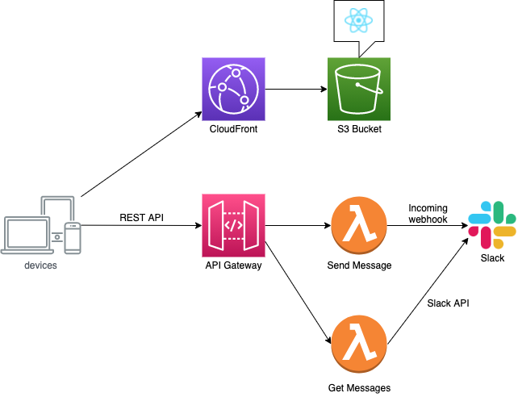

# chat-webhook-app

## Description

This is the sample serverless app using AWS CDK v2 and React.

## Architecture



## Requirements

- node.js
- React
- AWS CLI
- AWS CDK
- python 3.x

## How to deploy

- enable Slack Incoming webhook and get incoming webhook url
- get Slack API OAuth Token
- Write down incoming webhook url and OAuth Token in react app

- build front web app
  ```
  cd front
  npm install
  npm run build
  ```

- build lambda(install python libs)
   ```
   cd ../lambda
   pip-compile requirements.in
   pip install -r requirements.txt -t pylibs
   ```

- deploy all
   ```
   cd ../backend
   npm install
   npm run cdk:bootstrap
   npm run cdk:deploy
   ```


## How to destroy

- Delete objects in S3 bucket manually at first
  ```
  npm run cdk:destroy
  ```


## Reference

- [thilog.com](https://thilog.com/cdk-react-app)